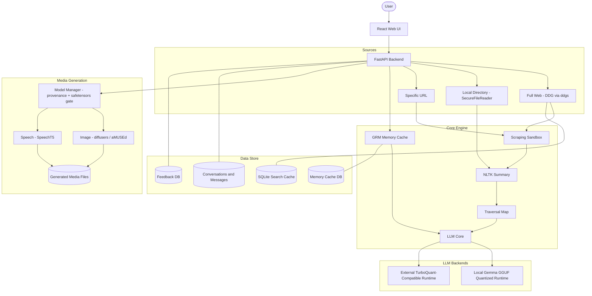

# KISS LLM (EfficientSearch LLM v1.7.0)

KISS LLM (Keep It Simple Search) is a local RAG system with a FastAPI backend, a React/Vite UI, source-linked passage retrieval, and incremental answers. The default model is **Gemma-2-2B-IT GGUF Q4_K_M** on CPU. The legacy Transformers backend and external inference runtimes remain optional. Web search sends queries to external sites; local-directory and direct modes can operate offline.

See [System Architecture](docs/ARCHITECTURE.md) for the implemented pipeline, streaming protocol, storage boundaries, and limitations. This README covers setup and operation.

## Key Features

* **Local Web UI**: React/Vite dashboard with a local Tailwind build pipeline, defaulting to a **voice-first** interface with an **Advanced** view toggle.
* **Voice In, Voice Out**: Speak a prompt; the app transcribes it locally (Whisper), auto-decides whether you want a spoken answer or an image, and replies with captioned speech (SpeechT5) or a generated picture (aMUSEd) — all on your hardware. See [Voice-First Interface](#voice-first-interface).
* **Selectable Search Sources**: Ground answers on the full web (DuckDuckGo via the `ddgs` package), a local directory of text files, or a single specific URL. See [Choosing a Search Source](#choosing-a-search-source).
* **Secure Local File Reading**: Directory sources are read through a hardened reader that allowlists text formats, confines access to the chosen folder, caps size/count, strips markup, and never executes files.
* **Context Recovery**: NLTK-assisted follow-up query reconstruction with lightweight fallbacks.
* **Compact Source RAG**: NLTK cleans source passages; SQLite FTS5/BM25 retrieves a small, source-linked evidence set for the model. A separate user-adjustable NLTK summary (10-30 sentences) remains available for inspection.
* **Self-Tuning Retrieval Policy**: The pipeline's exploration decisions (refresh vs. reuse, evidence-sufficiency bar, pages to scrape) live behind one prefix-only policy. Each query records a trace of its decisions and outcomes; an offline "dreaming" pass (Dream-RSI-style, arXiv:2609.14858) replays those traces to retune the policy for fewer fetches/scrapes at equal quality — no re-execution, no model training. Triggered via `POST /manage`. Independent scrapes run concurrently.
* **Self-Tuning Image Settings**: Generated images also record traces (steps, size, caption count) and take a 👍/👎 rating. A bandit tuner picks the cheapest step/caption settings whose thumbs-down rate isn't worse than the best observed, using epsilon exploration to gather the needed variation. (A small CPU model still can't render legible text or exact brand logos — that's a model limit, not a settings one.)
* **Incremental Answers**: Shows the NLTK preview, streams native local-model output as a draft, then displays the checked final answer. Text generation can be stopped.
* **Chat History**: Conversations are saved locally; you can reopen past chats with their context, start new chats, and delete chats. Each chat keeps its own isolated memory.
* **Conversation Memory**: Stores completed turns as compact textual states with lexical, relevance-gated retrieval. This is an application-level emulation, not a native RNN hidden-state cache.
* **Memory-Aware Local LLM**: Uses Gemma-2-2B-IT GGUF by default with quantized/compressed weights through llama.cpp.
* **Local Image & Speech Generation**: Optional media output that runs entirely on CPU — images (aMUSEd) and speech (SpeechT5) — with provenance-gated, safetensors-only model loading. See [Media Generation](#media-generation-phase-1).
* **Per-Response Settings**: Every answer shows the exact settings that produced it (source, sources searched, summary depth, beams, minimum length, validation mode).
* **TurboQuant Runtime Contract**: Can pass TurboQuant KV-cache settings to a compatible external LLM runtime.
* **Sandboxed Scraping**: RestrictedPython/Docker hooks for safer scraping.
* **Security First**: Sanitization, PII scrubbing, and local feedback storage.

## Quick Start

### 1. Prerequisites

* Python 3.11+
* Node.js
* DuckDuckGo access (for full-web searches)

Run commands from the project root. Use the existing `.venv` and downloaded models when available; no reinstall or model download is needed just to restart. On a new installation, create the environment once:

```powershell
python -m venv .venv
.\.venv\Scripts\python.exe -m pip install -r requirements.txt
```

SQLite must include FTS5. Keep the project's `llama-cpp-python==0.2.90` compatibility pin unless a replacement build has been tested on this CPU. The default GGUF file is `models/gemma-2-2b-it-Q4_K_M.gguf`; startup does not download it automatically.

### 2. Backend

```powershell
$env:PYTHONPATH="."
.\.venv\Scripts\python.exe -m uvicorn api.main:app --host 127.0.0.1 --port 8000
```

The API listens on `http://127.0.0.1:8000`. The LLM runs inside this backend process, not as a separate model service. It loads in the background by default (`WARM_LOCAL_LLM=true`), so API readiness does not necessarily mean the model is ready. The Vite dev server proxies `/api` to it.

Set `KISS_HOST` to change the bind address (default `127.0.0.1`; keep it local unless you intend to expose the service). Set `KISS_USE_DOCKER_SANDBOX=true` to run scraping inside the Docker sandbox instead of the in-process RestrictedPython sandbox.

### 3. Frontend

```powershell
cd web-ui
npm install
npm run dev
```

Visit [KISS LLM](http://127.0.0.1:3000). Skip `npm install` on an existing installation unless dependencies have changed. Vite uses strict port binding; an occupied port causes startup to fail rather than silently selecting another port.

### 4. Models (first-time setup)

Model weights are **not** included in the repository (they are large and third-party, so `models/` is git-ignored except its README). A fresh clone has the code but no weights — get them once:

* **Local LLM (required).** Download a quantized Gemma-2-2B-IT GGUF and place it at `models/gemma-2-2b-it-Q4_K_M.gguf` (or point `LOCAL_GGUF_MODEL_PATH` elsewhere). Startup does not fetch it automatically. See [models/README.md](models/README.md).
* **Image / speech / speech-to-text (optional).** aMUSEd, SpeechT5 (+ vocoder), and Whisper download to `models/media/<key>/` on first use once you verify and enable them — see [Enabling a modality](#enabling-a-modality). Nothing downloads until you opt in.
* **Voices (optional).** Build the SpeechT5 speaker voices once with `python scripts/build_speaker_embeddings.py` (a one-time ~16 MB download of the CMU ARCTIC x-vector set). See [Voice-First Interface](#voice-first-interface).

Local runtime state is also git-ignored and created automatically on first run: the SQLite databases and generated media under `data/`, and the API key at `data/.api-key` (a 64-char key is generated on first start; set `KISS_API_KEY` to supply your own).

### Stopping and restarting

Use **Stop generation** for an active text request, then press `Ctrl+C` in the backend and frontend terminals. Wait for both to exit. For detached/background launches, identify the listener PIDs and their process trees before stopping anything:

```powershell
Get-NetTCPConnection -State Listen |
    Where-Object { $_.LocalPort -in 3000, 8000 } |
    Select-Object LocalAddress, LocalPort, OwningProcess
```

Inspect each reported PID with `Get-CimInstance Win32_Process -Filter 'ProcessId = <PID>'`. Confirm it belongs to this checkout's Uvicorn or Vite process; Vite may use a relative command path, so also check its launch record and child executable paths. Then stop only those verified processes (and their app-owned children) with `Stop-Process -Id <PID>`. Do not use blanket `taskkill` commands for all Python or Node processes. Repeat the listener check; no rows means neither port has a listener.

Stopping releases loaded model memory but leaves `models/`, `.venv/`, `data/`, and logs on disk. Restart with the same two commands above and the same environment overrides. This does not stop an independently managed external LLM server.

### Local access and verification

Both servers bind to loopback by default. Every backend route requires a valid
`X-API-Key`; a random local key is generated in `data/.api-key`. The Vite dev and
preview proxies add this key server-side, so it is not embedded in the browser
bundle. Direct API clients must read the key locally and send that header.
Alternatively, set the same `KISS_API_KEY` in both server environments. Keep the
key private; it grants access to local chats, files, and inference. Never expose
the development proxy to a shared network. Production hosting needs its own
authenticated proxy; a static frontend build alone does not supply one.

Browser origins are restricted to `http://127.0.0.1:3000` and
`http://localhost:3000`. Override `KISS_ALLOWED_ORIGINS` with a comma-separated
list if using another local port. Wildcard origins are not accepted.

Directory searches default to this project folder. To allow other folders, set
`KISS_ALLOWED_DIRECTORIES` before starting the backend (semicolon-separated on
Windows, colon-separated on Unix). The selected folder must be inside an allowed
root, even when selected using Browse. For example:

```powershell
$env:KISS_ALLOWED_DIRECTORIES="C:\Documents\Research;C:\Documents\Notes"
```

Inference is serialized per model instance, with at most `LLM_MAX_PENDING=3`
running/queued calls. Timeouts signal cancellation; the model lock remains held
until native generation exits. Conversation history is bounded to 12 messages
and fitted to the model's actual token budget. All memory levels remain scoped
to their conversation.

Run the regression checks from the project root:

```powershell
.\.venv\Scripts\python.exe -m unittest discover -s tests -v
npm --prefix web-ui test
npm --prefix web-ui run build
.\.venv\Scripts\python.exe diagnostics.py --offline
```

Diagnostics do not delete databases. The optional `--clear-search-cache` flag
clears only cached search results, preserving conversations, feedback, and memory.

## Voice-First Interface

The app opens in a **Voice** view (toggle to **Advanced** any time via the header). It is designed for a speak-and-listen loop that runs entirely on local models:

1. **Tap the mic and speak your prompt.** Audio is captured in the browser and sent to the backend as a WAV; the server transcribes it locally with **Whisper** (`openai/whisper-base.en`, MIT, safetensors). Nothing is sent to a cloud speech service.
2. **The request is auto-routed.** A lightweight local intent check decides between a spoken text answer and an image. Say "draw / generate / show me an image (or picture, photo…) of …" to get a picture; anything else returns a spoken answer.
3. **You get a captioned, spoken reply.** Text answers are grounded on your chosen source (Internet / Files / URL), read aloud with **SpeechT5**, and shown as a copyable caption with the audio player. Image requests display the generated picture.

Voice turns accumulate into a **conversation thread** on screen (spoken prompt, then answer or image), and each turn is answered **in context**: the last several turns are sent with the request, so follow-ups that drop the subject ("when was it launched?", "how much did it cost?") are resolved against the conversation before searching and answering. Turns are saved to Chat History alongside typed ones and share the same conversation, so toggling to the Advanced view shows the same thread. Use **New conversation** to start fresh.

Before recording, pick a **Search Source** (Internet, Files, or URL) just as in the Advanced view. The **Settings** control on the voice screen exposes the options a spoken turn needs: **voice** (see below), **image size** (256 or 512 px), **web context for images** (see below), **max web sources**, and **summary depth**.

**Voices.** Spoken answers use SpeechT5 with a real speaker embedding (x-vector) for a natural, clear voice. Four voices ship — `female-clear`, `female-warm`, `male-clear`, `male-deep` — built from the CMU ARCTIC corpus (Carnegie Mellon, US-origin, permissive). Build them once with `python scripts/build_speaker_embeddings.py` (one-time ~16 MB download; offline afterward); they are saved as safetensors under `models/media/speaker-embeddings/`. Set the default with `TTS_VOICE` (default `female-clear`). Output is peak-normalized and edge-trimmed for consistent loudness.

**Web context for images.** When this toggle is on, an image request first runs a secure DuckDuckGo search on the subject — both a text search and an **image search** (whose result *captions* describe how the subject looks) — and uses the local LLM to compress the findings into a concise, vivid prompt before aMUSEd renders it. So "draw the James Webb telescope" is grounded in what it actually looks like (golden hexagonal mirror, etc.) instead of the model guessing. Only caption text is used; no web images are downloaded or fed to the model, so there is no copyright or binary-fetch exposure. It adds a short "researching" step; leave it off for the fastest, purely-local image path.

Long answers are spoken in full: the server splits them into sentence-sized chunks that stay within SpeechT5's input limit and concatenates the audio, so answers are never truncated mid-sentence.

Voice needs speech-to-text **and** text-to-speech enabled (`VOICE_ENABLED=true` and `TTS_ENABLED=true`, with the ASR/TTS models verified — see [Enabling a modality](#enabling-a-modality)); image replies also need `IMAGE_GEN_ENABLED=true`. Microphone capture requires a browser permission grant and a secure context (`localhost` counts). `GET /api/media/status` reports `voice_ready`.

## Choosing a Search Source

The **Search Source** control in the settings panel selects where evidence comes from for each query:

| Source | What it does | Notes |
| --- | --- | --- |
| **Full Web** | Searches the web with DuckDuckGo secure search (`ddgs`), keeping the top-10 source limit and a DDG Lite fallback. | Default mode. |
| **Local Directory** | Reads text files from a folder you choose and grounds the answer only on their contents. | Click **Browse…** to pick a folder with the native File Explorer dialog, or type the path. |
| **Specific URL** | Fetches one page you enter and grounds the answer only on that page. | Uses the same sandboxed, sanitized scraper as web results. |

### Secure directory reading

When a directory is selected, files are read through `security/file_reader.py` (`SecureFileReader`), which treats files as inert text and applies these safeguards:

* **Extension allowlist** — only text formats (for example `.txt`, `.md`, `.csv`, `.json`, `.html`, `.log`, `.yaml`); executables, scripts, and binaries are skipped.
* **Path confinement** — every file's resolved path must stay inside the chosen folder, and symlinks are rejected, so nothing outside the folder is read.
* **No execution** — files are opened read-only in binary mode and decoded as text; nothing is imported, evaluated, or run.
* **Markup neutralization** — `<script>`/`<style>` content and all HTML/XML tags are removed, and control characters are stripped.
* **Resource limits** — 1 MB per file, 12 MB total, 25 files, recursion depth 4; hidden files and folders are ignored.

The **Browse…** folder dialog is a local-desktop convenience served by the backend (`POST /pick-directory`) and is available on Windows only; on other platforms, type the path. The selected path is still read through `SecureFileReader`.

## Chat History

Conversations are stored locally in the SQLite `DataStore` (`data/es_llm.db`):

* **New Chat** starts a fresh conversation. A chat is created on the first message, so empty chats never clutter the list.
* Selecting a past chat **restores its full context** — messages, the source map, per-response settings, and each answer's NLTK summary.
* **Delete** removes a chat and its messages, and clears that chat's memory segments and indexed evidence.
* Each conversation has its **own isolated GRM memory** (memory is scoped to the conversation), so chats do not bleed context into one another.

## Tuning the Response

The settings panel (right of the chat) controls each query:

* **Response mode (Text only)** — trade speed for depth:
  * **Synthesis** (default) — full grounded LLM answer from the selected source. Best quality, slowest.
  * **Summary** — returns the fast NLTK extractive summary and **skips AI synthesis**. Grounded and much faster.
  * **Direct** — answers straight from the local model's own knowledge with **no web search**. Fastest, but not grounded/current.
* **Summary Depth (10-30 sentences)** controls the inspection summary, independently of the compact evidence supplied to the model.
* **Max Sources (1-10)**, **Beam Search (1-5)**, **Min Length**, and **Validation mode**.

Every answer displays the exact settings that produced it in its upper corner, and those settings are saved with the chat.

### Source evidence and incremental answers

NLTK cleans source text and extracts overlapping passages into SQLite FTS5 tables
in `data/es_llm.db`. BM25 retrieval ranks passages for the resolved current query,
removes redundant matches, and keeps source URLs and fetch timestamps. Full source
text remains available for the separate NLTK summary. Generated answers and chat
memory are not indexed as source evidence.

Gemma receives up to five relevant passages under an actual-token budget of
`EVIDENCE_TOKEN_BUDGET=512` (128-1024 configurable). Comparison questions can use
twice that budget, capped at 1024. Whole passages are packed without truncating
qualifications. Conversation history is supplied separately for intent. References
such as `[1]` correspond to the numbered sources in the source map.

Evidence is scoped by conversation, source type, and selected path. Web follow-ups
reuse cached evidence only when lexical coverage is sufficient and sources are
within `EVIDENCE_CACHE_TTL=3600` seconds. Explicit current/latest requests bypass
both evidence and search-result caches. Numeric constraints must match for cache
reuse. Local directories and explicit URLs are read again to detect changed or
removed content. Deleting a chat also deletes its indexed evidence.

The "sufficiency" bar, refresh triggers, and pages-to-scrape are governed by a
tunable retrieval policy (`engine/policy.py`, persisted to `data/policy.json`)
rather than fixed constants — see **Self-Tuning Retrieval Policy** above. The top
pages are scraped concurrently; `SCRAPE_CONCURRENCY=4` caps the worker count.
Run the offline tuning pass with `POST /manage {"action":"tune_policy"}` (or
`trigger_learn`) once enough query traces have accumulated.

Local GGUF answers now stream real generated chunks, not simulated typing. The UI
shows an NLTK preview, then an incremental draft, then the final answer after
grounding checks. The final answer can replace a draft when a fallback is needed.
Direct replies stream too; fixed code templates still return immediately. Spoken
responses show captions during generation, while audio is produced afterward.
External runtimes retain their existing complete-response protocol.

The text send button becomes **Stop generation** while a request runs. Stopped or
disconnected generations signal cancellation and do not save unfinished drafts as
completed answers. Partial text remains visible with an interruption status.

Final response metadata includes evidence token counts, cache hits, retrieval and
summary time, model queue time, prompt/completion tokens, first-chunk latency, and
total generation time. First-chunk latency includes prompt processing; it is not
an isolated prefill benchmark. CPU generation can still take time after retrieval.

## Media Generation (Phase 1)

Besides text, the app can generate **images and speech** locally, entirely on CPU. In the **Advanced** view, use the **Output** control (Text / Image / Speech); the **Voice** view uses the same models through the spoken-answer/image flow (see [Voice-First Interface](#voice-first-interface)). Runtimes are permissive OSS (`transformers`/`diffusers`, Apache-2.0). Phase 1 (image, speech, and local speech-to-text) is implemented and verified end-to-end.

* **Image** turns your prompt into a picture. An **Image model** dropdown lets you switch between registry image models (`amused-256` for speed, `amused-512` for more detail); picking one that isn't downloaded shows how to enable it. Only one image model is held in memory at a time (switching swaps it). Image prompts can optionally be enriched with secure web context (see the Voice section).
* **Speech** generates a short, direct **LLM reply** to your prompt and speaks it (a voice assistant), rather than reading your text back. The reply text is also shown in the chat. Speech uses a selectable natural voice (SpeechT5 + CMU ARCTIC x-vector) and chunks long text so nothing is cut off.
* **Speech-to-text** (Whisper, local) powers the voice-first interface.

Both media endpoints stream progress: speech reports `thinking → synthesizing`, and image reports per-step progress (`step N/total`, percent). The UI shows a live progress bar and an elapsed timer.

**Policy: US-origin weights, operator-verified.** All registry models are US-origin. Non-permissive licenses (aMUSEd/OpenRAIL) have been reviewed and accepted by the operator, so a per-model verification allowlist is the gate (not a blanket permissive rule). Set `MEDIA_REQUIRE_PERMISSIVE=true` to re-enforce MIT/Apache/BSD only. **FLUX is on the exclusion list and can never be used.** The registry lives in `engine/model_manager.py`.

### Modality status

| Output | Model (registry key) | License (verified from model card) | Notes |
| --- | --- | --- | --- |
| **Speech-to-text** | Whisper base.en (`whisper-base-en`) | **MIT** | OpenAI (US). Powers the voice-first flow. Fast on CPU. |
| **Speech** | SpeechT5 + vocoder (`speecht5`, `speecht5-vocoder`) | **MIT** | Microsoft (US). Fast on CPU. |
| **Speech (alt)** | Bark (`bark`) | MIT (card notes "research purposes only") | Suno (US). Heavier. |
| **Image** | aMUSEd (`amused-256`) | OpenRAIL++ (accepted) | Hugging Face (US). ~600M, CPU-capable. |
| **Image (alt)** | aMUSEd 512 (`amused-512`) | OpenRAIL++ (accepted) | Hugging Face (US). 512×512, more detail; ~3.5 GB, still CPU-practical (~25 s warm). |

### Supply-chain safeguards

* **Safetensors/ONNX only at runtime.** Pickle-family weights (`.bin`, `.pt`, `.ckpt`, `.pkl`, ...) can execute code on load and are never loaded. Downloads are restricted to safe file patterns and audited afterward.
* **Safe pickle conversion.** Some official models (e.g. SpeechT5) publish only `pytorch_model.bin`. With `MEDIA_ALLOW_PICKLE_CONVERSION=true`, the manager fetches the pickle, loads it with PyTorch's restricted `weights_only=True` unpickler (no code execution), re-saves it as safetensors, and deletes the pickle — so the runtime still only ever loads safetensors.
* **Exclusion list.** Excluded repositories (FLUX) are refused regardless of any other setting.
* **Pinned + integrity-checked.** Each model pins a revision and can pin SHA-256 hashes.
* **Verify-before-use.** A model is used only after an operator adds it to the verified allowlist and downloads are explicitly enabled.

### Enabling a modality

```powershell
# List only the models you have verified (origin + license).
$env:MEDIA_MODELS_VERIFIED="whisper-base-en,speecht5,speecht5-vocoder,amused-256,amused-512"
$env:MEDIA_ALLOW_DOWNLOADS="true"
$env:MEDIA_ALLOW_PICKLE_CONVERSION="true"   # needed for SpeechT5 (pickle-only upstream)
pip install -r requirements.txt
$env:TTS_ENABLED="true"          # speech (SpeechT5)
$env:IMAGE_GEN_ENABLED="true"    # image (amused-256 default; amused-512 also available)
$env:VOICE_ENABLED="true"        # voice-first flow: speech-to-text (Whisper) + routing
python api/main.py
```

Weights download to `models/media/<key>/` on first use; generated files are written to `data/media/` and served from `GET /media/{filename}` (path-confined). Until a modality is verified, enabled, and its model present, the UI shows a clear "unavailable" message with the exact setting to change. WAV output uses the standard-library `wave` module, so no `soundfile`/`libsndfile` (LGPL) dependency is needed.

**Performance:** all generation is CPU-only. SpeechT5 speech is near-real-time; aMUSEd images take roughly 1-3 minutes each at 256×256 (the first image after startup is slower while the model loads). SpeechT5 uses a real CMU ARCTIC x-vector voice by default (see [Voice-First Interface](#voice-first-interface) for building/selecting voices); `TTS_SPEAKER_EMBEDDING` still overrides with an operator-supplied `.safetensors`/`.npy` x-vector.

> **Note on GPU/NPU acceleration:** OpenVINO (Intel, Apache-2.0) was evaluated for the Intel Arc iGPU. It detects the device and works on simple models, but aMUSEd does not run correctly through OpenVINO's `torch.compile` path (a TorchDynamo issue with its dynamic graph corrupts the output), so image generation stays on CPU. There is no reliable, correct GPU path for this specific model today.

> Video generation is **Phase 3** and needs a discrete GPU this hardware does not have.

## Running Offline / Air-Gapped

Everything except live web search can run fully offline once models are downloaded.

* **Fully offline:** text answers (local Gemma), the **Local Directory** search source, image and speech generation (after weights are present), chat history, memory, and feedback. The media loaders use `local_files_only=True` and never reach the network at load time.
* **Requires internet at runtime (by nature):** **Full Web** search and the **Specific URL** source, which fetch live web content.
* **Requires internet once, then never again:** downloading model weights (Gemma GGUF and any media models), NLTK tokenizer data (falls back to regex if absent), and `pip`/`npm` installs.

To deploy air-gapped:

1. On a connected staging machine, download the model weights and NLTK data.
2. Copy `models/` (and the NLTK data) to the air-gapped machine.
3. Set offline guards so nothing phones home, and keep downloads disabled:

   ```powershell
   $env:HF_HUB_OFFLINE="1"
   $env:TRANSFORMERS_OFFLINE="1"
   $env:MEDIA_ALLOW_DOWNLOADS="false"
   ```

4. Use **Local Directory** (or plain text/media generation) as the source. Live web search is the only capability that cannot work offline.

## LLM Memory Options

The default backend is a local quantized Gemma-2-2B-IT GGUF model:

```powershell
$env:LOCAL_LLM_BACKEND="gguf"
$env:LOCAL_LLM_MODEL="gemma-2-2b-it"
$env:LOCAL_GGUF_MODEL_PATH="models/gemma-2-2b-it-Q4_K_M.gguf"
$env:LOCAL_GGUF_CHAT_FORMAT="gemma"
$env:LOCAL_GGUF_N_CTX="4096"
$env:LOCAL_GGUF_N_THREADS="8"    # defaults to all CPU cores (fastest here)
$env:LOCAL_GGUF_N_BATCH="512"   # prompt-eval batch size
$env:LOCAL_GGUF_N_GPU_LAYERS="0"
$env:LOCAL_LLM_MEMORY_PROFILE="q4_k_m"
$env:SYNTHESIS_MAX_TOKENS="288" # cap on synthesized answer length (lower = faster)
$env:SYNTHESIS_NOTES_CHARS="4000" # max grounding chars handed to the model
$env:LLM_MAX_PENDING="3"        # max queued inference requests before rejecting
```

Place a quantized Gemma-2-2B-IT GGUF file at `models/gemma-2-2b-it-Q4_K_M.gguf`, or point `LOCAL_GGUF_MODEL_PATH` at another compressed variant such as Q4_K_M, Q5_K_M, or Q8_0.

**CPU speed.** For fastest responses on CPU the local model runs greedy (no beam search), uses all cores by default, and caps answer length. On this 8-core class of hardware, using all 8 threads benchmarked fastest (≈26 tok/s vs ≈23 at 4 threads); `LOCAL_GGUF_N_THREADS` now defaults to the full core count. If the machine feels starved during generation, drop it by one or two. Keep **Beam Search = 1** (the default) for speed; higher beam counts are slower on CPU. Lower `SYNTHESIS_MAX_TOKENS` for shorter, quicker answers.

The legacy Transformers fallback remains available:

```powershell
$env:LOCAL_LLM_BACKEND="transformers"
$env:LOCAL_LLM_MODEL="google/flan-t5-large"
$env:LOCAL_LLM_MEMORY_PROFILE="low_memory"
```

For the Transformers fallback, `low_memory` applies dynamic int8 quantization on CPU and float16 loading on CUDA. Set `LOCAL_LLM_MEMORY_PROFILE=quality` to keep float32 behavior.

## Growing Memory Cache

KISS LLM includes a software emulation of the Memory Caching pattern from "Memory Caching: RNNs with Growing Memory". The local Gemma GGUF runtime is not recurrent and is not retrained here, so the implementation does not cache private RNN hidden tensors. Instead, each completed turn becomes a structured segment state stored in `data/memory_cache.db`:

* summary
* facts
* goals
* decisions
* entities
* sparse lexical embedding
* importance score

At query time, the backend retrieves candidate states and composes a compact `[GRM MEMORY CACHE]` block using:

```text
gate = 0.40 * relevance + 0.25 * importance + 0.20 * recency + 0.15 * project_match
```

Sparse Selective Caching is enabled automatically once the memory store reaches the configured threshold.

```powershell
$env:MEMORY_CACHE_ENABLED="true"
$env:MEMORY_RETRIEVAL_MODE="grm"   # grm, residual, ssc, or auto
$env:MEMORY_CONTEXT_TOP_K="5"      # retrieved segments per turn
$env:MEMORY_CONTEXT_CHARS="2500"   # context budget from memory (chars)
$env:MEMORY_MIN_RELEVANCE="0.22"   # score floor for retrieval
$env:MEMORY_HOT_LIMIT="100"        # hot-set size before consolidation
$env:MEMORY_PROJECT="default"
$env:MEMORY_SSC_THRESHOLD="10000"
$env:MEMORY_CONSOLIDATE_INTERVAL_SEC="3600"  # background consolidation cadence
```

A consolidation pass can also be triggered on demand with `POST /manage {"action":"trigger_learn"}`.

Inspect memory status:

```powershell
Invoke-WebRequest http://127.0.0.1:8000/memory/status -UseBasicParsing
```

## TurboQuant

Google TurboQuant is a KV-cache/vector-quantization method. The local Gemma GGUF path keeps weights compressed through quantized GGUF files, while TurboQuant KV-cache settings are forwarded to a compatible external inference runtime.

Example OpenAI-compatible runtime configuration:

```powershell
$env:EXTERNAL_LLM_URL="http://127.0.0.1:8080/v1"
$env:EXTERNAL_LLM_FORMAT="openai"
$env:EXTERNAL_LLM_MODEL="your-turboquant-enabled-model"
$env:TURBOQUANT_ENABLED="true"
$env:TURBOQUANT_BITS="3.5"
$env:PYTHONPATH="."
python api/main.py
```

For a custom KISS-style runtime, set `EXTERNAL_LLM_FORMAT=kiss`; the backend sends a `turboquant` object in the JSON payload plus `X-KISS-TurboQuant` headers.

References:

* Google Research: [TurboQuant: Redefining AI efficiency with extreme compression](https://research.google/blog/turboquant-redefining-ai-efficiency-with-extreme-compression/)
* Paper: [TurboQuant: Online Vector Quantization with Near-optimal Distortion Rate](https://arxiv.org/abs/2504.19874)

## Architecture



## Diagnostics

```powershell
$env:PYTHONPATH="."
python diagnostics.py
```

The diagnostics script checks cache state, search, and external LLM connectivity. It also warns when `TURBOQUANT_ENABLED=true` is set without an external runtime.

## HTTP API

The backend exposes these endpoints (base `http://127.0.0.1:8000`):

| Method & path | Purpose |
| --- | --- |
| `POST /query` | Run a query; streams newline-delimited JSON events (`progress`, `preliminary_result`, `final_result`). Accepts `response_mode` (`synthesis`/`nltk`/`direct`), `source_mode` (`web`/`directory`/`url`), `source_path`, `summary_sentences`, `max_sources`, `num_beams`, `min_length`, `validation_mode`, and `conversation_id`. Requires the `X-API-Key` header. |
| `GET /conversations` | List saved chats. |
| `POST /conversations` | Create a chat. |
| `GET /conversations/{id}` | Fetch a chat and its messages. |
| `PATCH /conversations/{id}` | Rename a chat. |
| `DELETE /conversations/{id}` | Delete a chat and clear its memory. |
| `POST /pick-directory` | Open the native folder picker (Windows only) and return the chosen path. |
| `POST /generate/image` | Generate an image from a prompt; streams NDJSON progress (`step N/total`, percent) then `final_result`. Requires `X-API-Key`. |
| `POST /generate/audio` | Generate a spoken LLM reply to the prompt (or verbatim speech with `speak_verbatim:true`); accepts `voice`; streams NDJSON progress then `final_result` (includes the reply `text`). Requires `X-API-Key`. |
| `POST /transcribe` | Transcribe a raw WAV request body to text locally (Whisper). Returns `{text}`. Requires `X-API-Key`. |
| `POST /voice` | Voice-first turn: takes a `transcript` (plus `source_mode`, `source_path`, `max_sources`, `image_size`, `summary_sentences`, `conversation_id`, `history`, `voice`, and `enrich_context`), auto-routes to a spoken grounded answer or an image, and streams NDJSON progress then `final_result` (`kind:'text'` with `text`, audio `url`, `sources`, or `kind:'image'` with `url`, `prompt`, `sources`). Requires `X-API-Key`. |
| `GET /media/status` | Media modality availability (including `asr` and `voice_ready`) plus each model's provenance, license, and verification state. |
| `GET /media/{filename}` | Serve a generated media file (path-confined to `data/media/`). |
| `POST /feedback` | Save a user correction. |
| `POST /manage` | Local management actions: `get_status` (version, security, memory stats); `trigger_learn` (memory consolidation **and** retrieval-policy tuning); `tune_policy` (tuning only); `get_policy` (current policy + trace count). |
| `GET /config`, `GET /health`, `GET /memory/status` | Runtime configuration, health, and memory status. |
| `GET /docs` | Compact JSON endpoint list (replaces the default Swagger UI at this path). |

`/query` and `/voice` stream token-by-token: synthesis emits `answer_delta` events as the answer is generated. Both retrieve from a per-conversation **FTS5 evidence index** first and only fetch fresh sources when the stored passages don't sufficiently cover the query (or the query is time-sensitive), so repeat and follow-up questions in a chat are fast.

## Troubleshooting

**Search returns unrelated results.** The DuckDuckGo library was renamed from `duckduckgo_search` to `ddgs`; the old package is deprecated and can return unrelated results for any query. This project depends on `ddgs`. If you see off-topic results, run `pip install -r requirements.txt` to ensure `ddgs` is installed.

**`WinError 0xc000001d` / illegal instruction when loading the GGUF model.** Some prebuilt `llama-cpp-python` wheels (0.3.x) include AVX-512 kernels that crash on CPUs without AVX-512 (for example, Intel Core Ultra / Lunar Lake). This project pins `llama-cpp-python==0.2.90`, the last AVX2-only CPU wheel, which runs on virtually all x86-64 CPUs. Reinstall with `pip install -r requirements.txt` if you hit this.

**`load_state: error` in `/health`.** The Gemma GGUF model file is missing. Place a quantized Gemma-2-2B-IT GGUF at `models/gemma-2-2b-it-Q4_K_M.gguf` (or set `LOCAL_GGUF_MODEL_PATH`). See [LLM Memory Options](#llm-memory-options).

**Spoken answers sound flat or robotic.** The named voices have not been built, so SpeechT5 is falling back to a neutral (zero) speaker embedding. Run `python scripts/build_speaker_embeddings.py` once to create the `female-clear` / `female-warm` / `male-clear` / `male-deep` x-vectors under `models/media/speaker-embeddings/`, then pick a voice in **Voice → Settings** or set `TTS_VOICE`. See [Voice-First Interface](#voice-first-interface).

**The mic button does nothing / "microphone access was blocked."** Voice capture needs a microphone permission grant and a secure context. Use `http://localhost:3000` (localhost counts as secure) and allow the mic when the browser prompts; if you dismissed it, click the mic/lock icon in the address bar to re-enable, then tap the mic again.

## License

MIT License.
